---
## Author
author:
  name: Ко Антон Геннадьевич
  degrees: DSc
  orcid: 0000-0002-0877-7063
  email: antonkosakh@gmail.com
  affiliation:
    - name: Российский университет дружбы народов
      country: Российская Федерация
      postal-code: 117198
      city: Москва
      address: ул. Миклухо-Маклая, д. 6
## Title
title: Лабораторная работа №1
subtitle: Julia. Установка и настройка. Основные принципы
license: CC BY
date: today
date-format: "YYYY-MM-DD" # Example: 2026-09-12
---

# Информация

## Докладчик

:::::::::::::: {.columns align=center}
::: {.column width="70%"}

  * Ко Антон Геннадьевич
  * студент
  * Российский университет дружбы народов им. П. Лумумбы
  * [1132221551@rudn.ru](mailto:1132221551@rudn.ru)
  * <https://SenDerMen04.github.io/ru/>

:::
::: {.column width="30%"}

:::
::::::::::::::

## Цель работы

Основная цель работы — подготовить рабочее пространство и инструментарий для работы с языком программирования Julia, на простейших примерах познакомиться с основами синтаксиса Julia.

---

Выполнение лабораторной работы

Так как мы используем ОС типа Windows, для различных установок будем использовать менеджер пакетов Chocolatey (https://chocolatey.org/), который установим через Administrative Shell. Но так, как он уже был установлен, вот рисунок того, что он уже есть (рис. #fig:001):

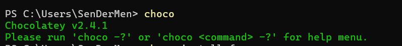{#fig:001 width=100%}

---

Далее посредством установленного менеджера установим Far Manager, Notepad++, Julia, Anaconda Distribution (Python 3.x) (рис. #fig:002 – #fig:005):

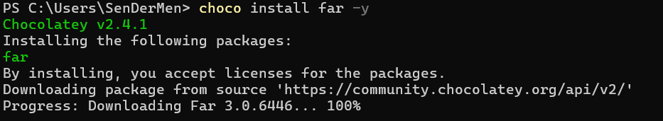{#fig:002 width=100%}

---

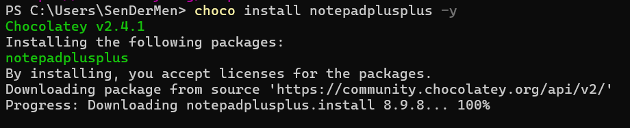{#fig:003 width=100%}

---

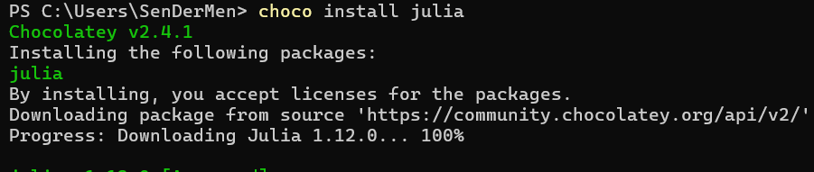{#fig:004 width=100%}

---

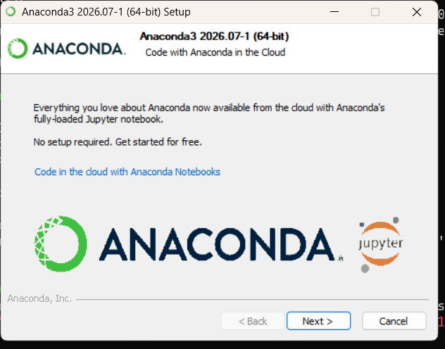{#fig:005 width=100%}

---

Следующим шагом установим пакеты для работы с Jupyter. Для этого перейдём в пакетный режим Julia, нажав на клавиатуре знак закрывающейся квадратной скобки `]`, затем введём `add IJulia` (рис. #fig:006):

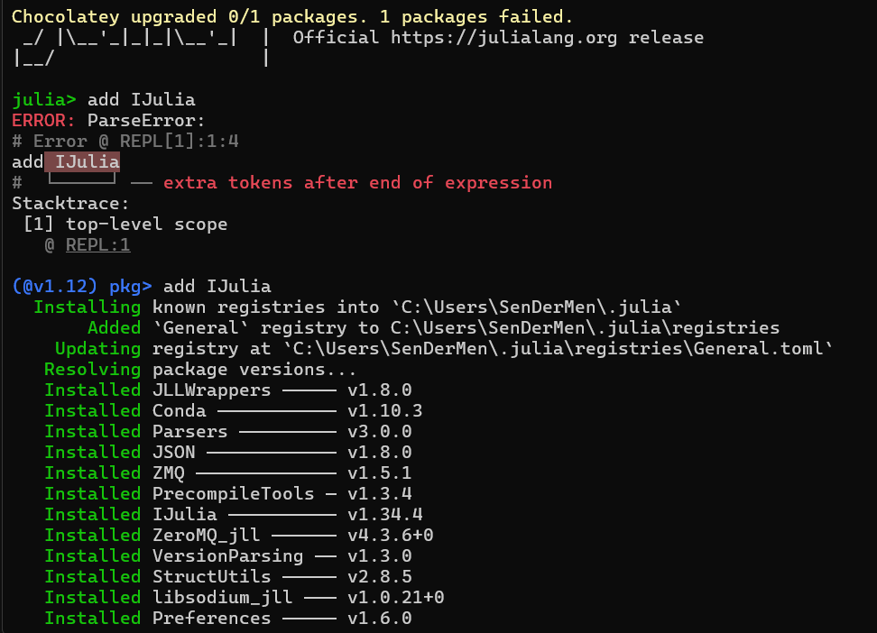{#fig:006 width=100%}

---

Основы синтаксиса Julia на примерах

Для начала потренируемся с определением типов числовых величин (рис. #fig:007):

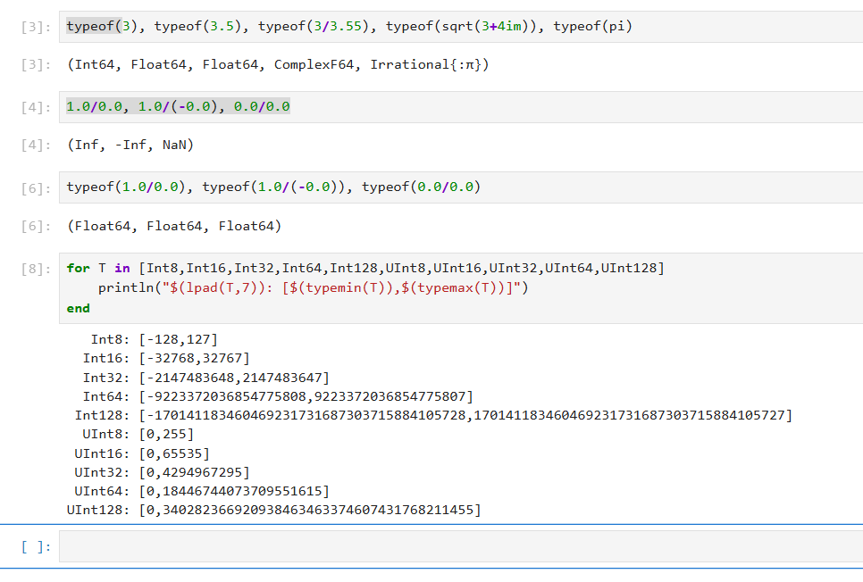{#fig:007 width=100%}

---

После чего приступим к рассмотрению приведения аргументов к одному типу (рис. #fig:008):

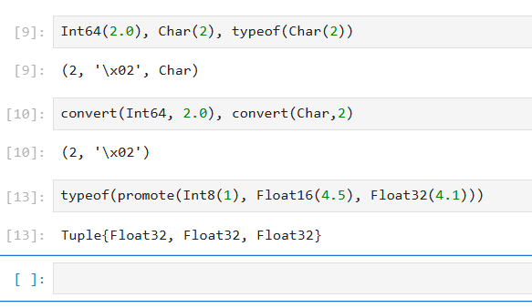{#fig:008 width=100%}

---

И рассмотрим примеры определения функций (рис. #fig:009), а также работу с массивами (рис. #fig:010):

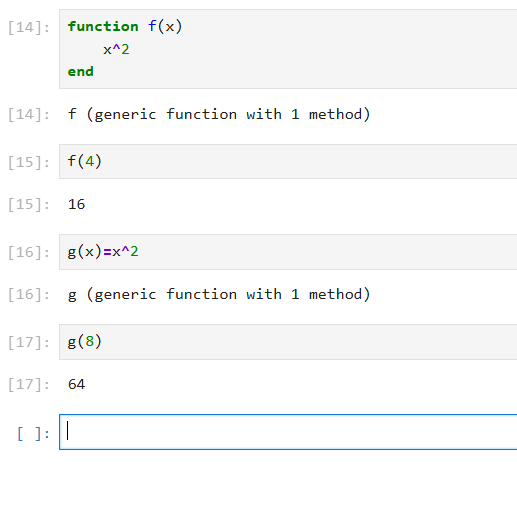{#fig:009 width=100%}

---

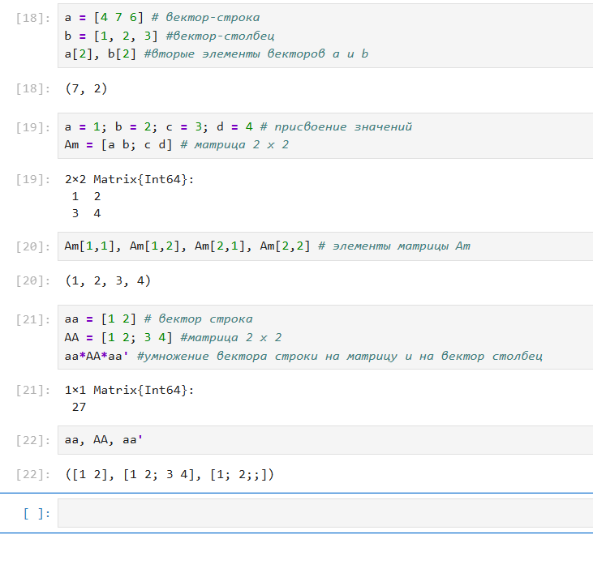{#fig:010 width=100%}

---

### Самостоятельная работа

В первом задании рассмотрим основные функции для чтения / записи / вывода информации на экран. Для этого составим свои примеры (рис. #fig:011):

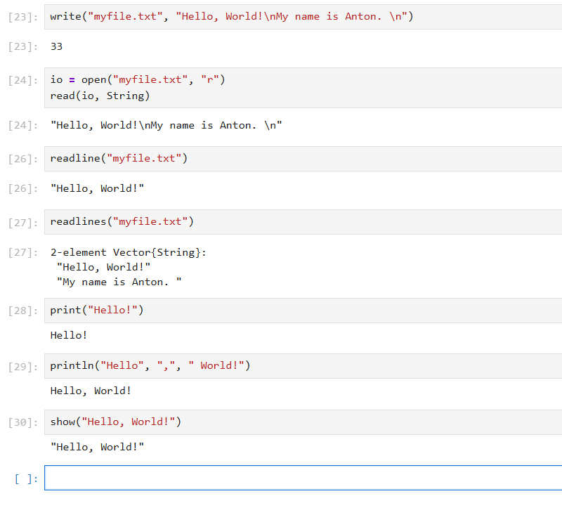{#fig:011 width=100%}

---

Во втором задании составим пример для функции `parse()` (рис. #fig:012):

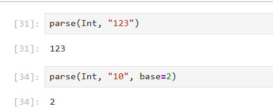{#fig:012 width=100%}

---

Далее изучим синтаксис Julia для базовых математических операций с разным типом переменных (рис. #fig:013):

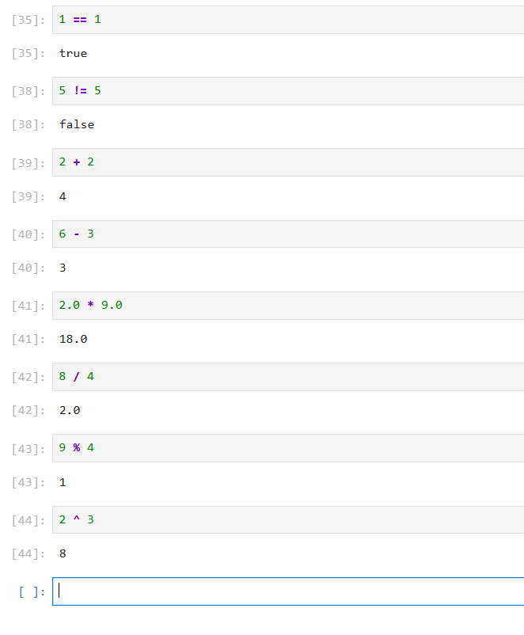{#fig:013 width=100%}

---

В конце работы приведём несколько примеров с операциями над матрицами (рис. #fig:015):

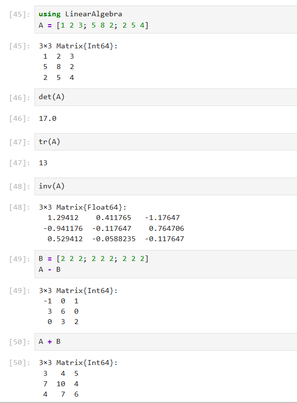{#fig:015 width=100%}

---

## Вывод

В ходе выполнения лабораторной работы были получены навыки по подготовке рабочего пространства и инструментария для работы с языком программирования Julia, а также познакомились на простейших примерах с основами синтаксиса Julia.

---

## Список литературы. Библиография

1. Julia Documentation: https://docs.julialang.org/en/v1/